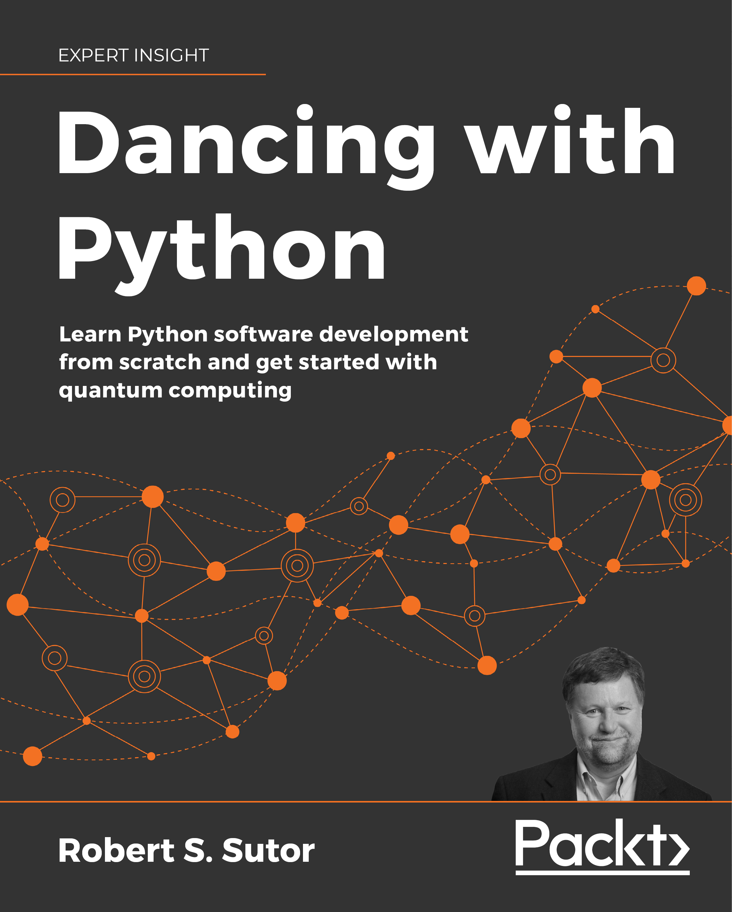

# Dancing-with-Python

This is the code repository for [Dancing-with-Python](https://www.packtpub.com/product/dancing-with-python/9781801077859),
published by [Packt](https://www.packtpub.com/?utm_source=github). It contains
all the supporting project files necessary to work through the book from start
to finish.

## Links

* [Amazon](https://www.amazon.com/Dancing-Python-software-development-computing/dp/1801077851/ref=sr_1_2?dchild=1&keywords=Dancing+with+Python&qid=1629267430&s=books&sr=1-2)
* [Packt Publishing](https://www.packtpub.com/product/dancing-with-python/9781801077859)

## About the Book

Coding is the art and engineering of creating software, and Python has been one of the core coding languages for many years. This introductory Python book helps you learn classical and quantum computing in a unified and practical way. It will help you explore how to work with numbers, strings, collections, iterators, and files.

The book goes beyond functions and classes and teaches you to use Python and Qiskit to create gates and circuits for classical and quantum computing. Learn how quantum extends classical techniques using the Grover Search Algorithm and the code that implements it. Dive into some advanced and widely used applications of Python and revisit strings with more sophisticated tools such as regular expressions and basic natural language processing (NLP). The final chapters introduce you to data analysis, visualizations, and supervised and unsupervised machine learning. By the end of the book, you will be proficient in classical coding and programming the latest and most powerful quantum computers.

## Table of Contents
1. Doing the Things that Coders Do
2. Working with Expressions
3. Collecting Things Together
4. Stringing You Along
5. Computing and Calculating
6. Defining and Using Functions
7. Organizing Objects into Classes
8. Working with Files
9. Understanding Gates and Circuits
10. Optimizing and Testing Your Code
11. Searching for the Quantum Improvement
12. Searching and Changing Text
13. Creating Plots and Charts
14. Analyzing Data
15. Learning Briefly
16. Appendix A Tools
17. Appendix B. Staying current
18. Appendix C. The Complete UniPoly Class
19. Appendix D. The Complete Guitar Class Hierarchy
20. Appendix E. Notices
21. Appendix F. Production Notes

